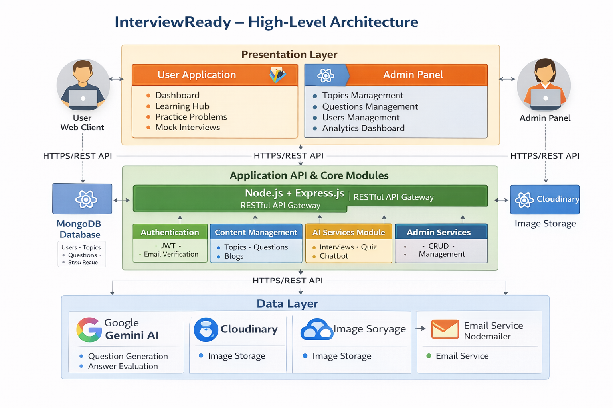
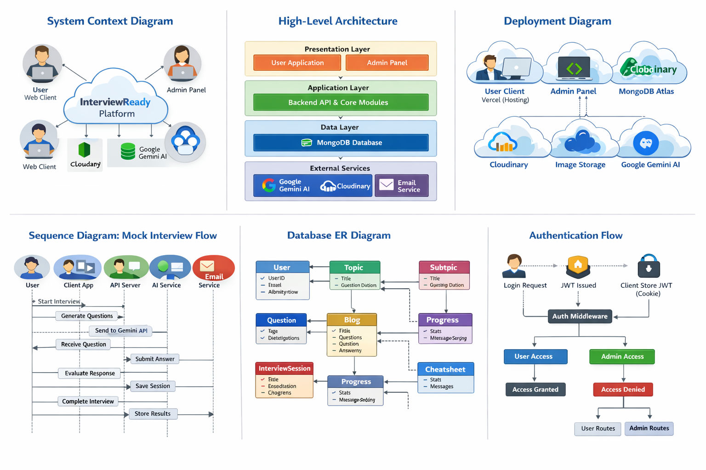

# InterviewReady - High-Level Design (HLD) Overview

## System Architecture Overview

This document provides a high-level design overview of the InterviewReady platform, showing the main architectural layers, components, and their interactions.

---

## HLD Architecture Diagram




## Simplified System Flow Diagram




## System Layers Overview

### 1. Presentation Layer
**Purpose:** User interface and user interactions

**Components:**
- **User Client Application** (Port 5173)
  - Built with React 19 + Vite
  - State Management: Redux Toolkit
  - Features: Dashboard, Learning, Practice, Mock Interviews, Blogs, Quiz, Chatbot
  
- **Admin Panel** (Port 5174)
  - Built with React 19 + Vite
  - State Management: React Context API
  - Features: Content Management, User Management, Analytics

### 2. Application Layer
**Purpose:** Business logic, API endpoints, and service orchestration

**Components:**
- **RESTful API Server** (Port 5000/8000)
  - Built with Node.js + Express.js
  - Security: JWT, Helmet, CORS, Rate Limiting
  - Architecture: MVC Pattern

**Core Modules:**
1. **Authentication Module**
   - User registration/login
   - JWT token management
   - Email verification
   - Session handling

2. **Content Management Module**
   - Topics & Subtopics CRUD
   - Questions management
   - Blog operations
   - Cheatsheets

3. **AI Services Module**
   - Mock interview orchestration
   - Quiz generation
   - Answer evaluation
   - Chatbot interactions

4. **Progress Tracking Module**
   - User statistics
   - Learning progress
   - Interview history
   - Performance analytics

5. **Admin Services Module**
   - Administrative operations
   - User management
   - Content moderation
   - System analytics

### 3. Data Layer
**Purpose:** Persistent data storage

**Database:** MongoDB (NoSQL)
- Users collection
- Topics & Subtopics collections
- Questions collection
- Blogs collection
- Interview Sessions collection
- Progress collection
- Chat History collection
- Cheatsheets collection

### 4. External Services
**Purpose:** Third-party integrations for enhanced functionality

1. **Google Gemini AI**
   - Interview question generation
   - Answer evaluation and scoring
   - Quiz generation
   - Chatbot responses

2. **Cloudinary**
   - Image storage and management
   - File uploads
   - CDN delivery

3. **Email Service (Nodemailer)**
   - Email verification
   - Transactional emails
   - Notifications

---

## Key Architectural Patterns

### 1. **Layered Architecture**
- Clear separation between Presentation, Application, and Data layers
- Each layer has distinct responsibilities
- Layers communicate through well-defined interfaces

### 2. **RESTful API Design**
- Standard HTTP methods (GET, POST, PUT, DELETE)
- Resource-based URLs
- Stateless communication
- JSON data format

### 3. **Modular Design**
- Feature-based module organization
- Reusable components and services
- Separation of concerns

### 4. **Token-Based Authentication**
- JWT tokens for stateless authentication
- HTTP-only cookies for security
- Role-based access control

### 5. **Service-Oriented Architecture**
- External services abstracted through service layers
- API integrations isolated from business logic
- Easy to swap or extend services

---

## Data Flow Patterns

### Request Flow
```
User Action → Client App → API Gateway → 
  Authentication Middleware → Route Handler → 
  Controller → Service/Model → Database →
  Response back through layers → User
```

### AI-Enhanced Flow
```
User Request → API → AI Service Module → 
  External AI Service (Gemini) → 
  Process Response → Save to Database → 
  Return to User
```

### File Upload Flow
```
User Upload → API → Validation → 
  Cloudinary Service → Store File → 
  Save URL to Database → Return to User
```

---

## Technology Stack Summary

| Layer | Technology |
|-------|-----------|
| **Frontend** | React 19, Vite, TailwindCSS |
| **State Management** | Redux Toolkit, React Context |
| **Backend** | Node.js, Express.js |
| **Database** | MongoDB (Mongoose ODM) |
| **Authentication** | JWT, bcryptjs |
| **AI Services** | Google Gemini AI (@google/genai) |
| **File Storage** | Cloudinary |
| **Email** | Nodemailer |
| **Deployment** | Vercel (Frontend), Node Server (Backend) |

---

## System Characteristics

### Scalability
- Stateless API design allows horizontal scaling
- Database can be scaled independently
- External services handle their own scaling

### Security
- JWT-based authentication
- Password hashing with bcrypt
- CORS protection
- Rate limiting
- Security headers (Helmet)
- Input validation

### Performance
- Response compression
- Database indexing
- Efficient query patterns
- CDN for static assets (Cloudinary)

### Reliability
- Error handling at all layers
- Transaction management
- External service error handling
- Graceful degradation

---

## Deployment Architecture

```
┌─────────────────────────────────────────┐
│         Internet/Cloud                  │
└─────────────────────────────────────────┘
           │
    ┌──────┴──────┐
    │             │
┌───▼───┐    ┌───▼────┐
│Client │    │ Admin  │
│Vercel │    │ Vercel │
└───┬───┘    └───┬────┘
    │            │
    └─────┬──────┘
          │
    ┌─────▼──────┐
    │ Backend API│
    │   Server   │
    │  (Node.js) │
    └─────┬──────┘
          │
    ┌─────┴──────┐
    │            │
┌───▼───┐   ┌───▼────┐
│MongoDB│   │External│
│ Atlas │   │Services│
└───────┘   └────────┘
```

---

This HLD overview provides a high-level understanding of the InterviewReady platform architecture, focusing on the main components, layers, and their interactions without diving into implementation details.

