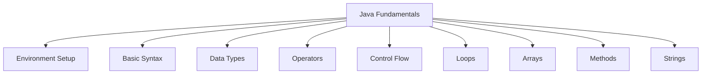

# The Ultimate Java Beginner's Guide: Master the Fundamentals



## 1. Introduction to Java
Java is a powerful, **platform-independent**, **object-oriented** programming language used by over 10 million developers worldwide. Created by James Gosling in 1995, Java's "Write Once, Run Anywhere" capability comes from its compilation to bytecode that runs on the Java Virtual Machine (JVM).

### Key Features:
- 🚀 **Platform Independence** (JVM-based)
- 🔒 **Automatic Memory Management** (Garbage Collection)
- 🛡️ **Built-in Security Features**
- 📚 **Rich Standard Library**
- ⚡ **High Performance** (Just-In-Time compilation)
- 🧵 **Multithreading Support**

## 2. Environment Setup

### Step-by-Step Installation:
1. **Download JDK**: 
   - [Oracle JDK](https://www.oracle.com/java/technologies/downloads/)
   - [OpenJDK](https://adoptium.net/)

2. **Install IDE**:
   - [IntelliJ IDEA](https://www.jetbrains.com/idea/)
   - [Eclipse](https://www.eclipse.org/downloads/)
   - [VS Code](https://code.visualstudio.com/) with Java Extension Pack

3. **Set Environment Variables**:
   ```bash
   # Linux/macOS
   export JAVA_HOME=/path/to/jdk
   export PATH=$JAVA_HOME/bin:$PATH
  
   # Windows
   setx JAVA_HOME "C:\path\to\jdk"
   setx PATH "%PATH%;%JAVA_HOME%\bin"
   ```

4. **Verify Installation**:
   ```bash
   java -version
   javac -version
   ```

### First Java Program:
```java
public class HelloWorld {
    public static void main(String[] args) {
        System.out.println("Hello, Java World!"); 
    }
}
```

**Compile & Run**:
```bash
javac HelloWorld.java  # Compiles to bytecode
java HelloWorld        # Executes on JVM
```

## 3. Basic Syntax & Structure
```java
// Class declaration (must match filename)
public class MyClass {
    
    // Main method - program entry point
    public static void main(String[] args) {
        
        // Statement ending with semicolon
        System.out.println("Java syntax!");
        
        // Variables
        int number = 10;
    }
}
```

### Comments:
```java
// Single-line comment

/* 
Multi-line
comment 
*/

/**
 * Javadoc comment (for documentation)
 * @param args command-line arguments
 */
```

## 4. Data Types & Variables

### Primitive Data Types:
| Type    | Size    | Default | Range                     | Example           |
|---------|---------|---------|---------------------------|-------------------|
| `byte`  | 1 byte  | 0       | -128 to 127               | `byte b = 100;`   |
| `short` | 2 bytes | 0       | -32,768 to 32,767         | `short s = 200;`  |
| `int`   | 4 bytes | 0       | -2³¹ to 2³¹-1             | `int i = 1000;`   |
| `long`  | 8 bytes | 0L      | -2⁶³ to 2⁶³-1             | `long l = 5000L;` |
| `float` | 4 bytes | 0.0f    | ±1.4E-45 to ±3.4E+38      | `float f = 3.14f;`|
| `double`| 8 bytes | 0.0d    | ±4.9E-324 to ±1.7E+308    | `double d = 9.99;`|
| `char`  | 2 bytes | '\u0000'| 0 to 65,535               | `char c = 'A';`   |
| `boolean`| 1 bit  | false   | true/false                | `boolean flag = true;` |

### Reference Types:
- `String`: `String name = "Alice";`
- Arrays: `int[] numbers = {1, 2, 3};`
- Classes
- Interfaces

### Type Casting:
```java
// Widening (automatic)
int myInt = 9;
double myDouble = myInt;  // 9.0

// Narrowing (manual)
double pi = 3.14159;
int intPi = (int) pi;     // 3
```

## 5. Operators

### Common Operators:
```java
int a = 10, b = 3;

// Arithmetic
System.out.println(a + b);  // 13
System.out.println(a % b);  // 1

// Relational
System.out.println(a > b);  // true

// Logical
System.out.println((a > 0) && (b > 0));  // true

// Assignment
a += 5;  // a = 15

// Ternary
String result = (a > 10) ? "High" : "Low";  // "High"
```

## 6. Input & Output

### Output Methods:
```java
System.out.print("Hello");     // Without newline
System.out.println("World!");  // With newline
System.out.printf("Value: %.2f", 3.14159);  // Formatted
```

### Input with Scanner:
```java
import java.util.Scanner;

public class UserInput {
    public static void main(String[] args) {
        Scanner scanner = new Scanner(System.in);
        
        System.out.print("Enter name: ");
        String name = scanner.nextLine();
        
        System.out.print("Enter age: ");
        int age = scanner.nextInt();
        
        System.out.printf("Hello %s! You're %d years old.", name, age);
        
        scanner.close();  // Prevent resource leaks
    }
}
```

## 7. Control Flow Statements

### if-else:
```java
int score = 85;

if (score >= 90) {
    System.out.println("Grade A");
} else if (score >= 75) {
    System.out.println("Grade B");
} else {
    System.out.println("Grade C");
}
```

### switch-case:
```java
int day = 3;
String dayName;

switch (day) {
    case 1 -> dayName = "Monday";   // Java 14+ syntax
    case 2 -> dayName = "Tuesday";
    case 3 -> dayName = "Wednesday";
    default -> dayName = "Invalid";
}
System.out.println(dayName);  // Wednesday
```

## 8. Loops

### for Loop:
```java
// Print numbers 1-5
for (int i = 1; i <= 5; i++) {
    System.out.println(i);
}
```

### while Loop:
```java
int count = 1;
while (count <= 5) {
    System.out.println(count);
    count++;
}
```

### do-while Loop:
```java
int num = 1;
do {
    System.out.println(num);
    num++;
} while (num <= 5);
```

### Loop Control:
```java
// Break statement
for (int i = 1; i <= 10; i++) {
    if (i == 5) break;  // Exit loop at 5
    System.out.println(i);
}

// Continue statement
for (int i = 1; i <= 10; i++) {
    if (i % 2 == 0) continue;  // Skip even numbers
    System.out.println(i);  // Prints odds only
}
```

## 9. Arrays

### 1D Arrays:
```java
// Declaration & initialization
int[] numbers = {10, 20, 30, 40};

// Access elements
System.out.println(numbers[0]);  // 10

// Modify element
numbers[1] = 25;  // {10, 25, 30, 40}

// Length property
System.out.println(numbers.length);  // 4

// Loop through array
for (int num : numbers) {
    System.out.println(num);
}
```

### 2D Arrays:
```java
int[][] matrix = {
    {1, 2, 3},
    {4, 5, 6},
    {7, 8, 9}
};

// Access element
System.out.println(matrix[1][2]);  // 6

// Nested loop traversal
for (int i = 0; i < matrix.length; i++) {
    for (int j = 0; j < matrix[i].length; j++) {
        System.out.print(matrix[i][j] + " ");
    }
    System.out.println();
}
```

## 10. Methods

### Method Basics:
```java
public class Calculator {
    
    // Method with parameters and return value
    public static int add(int a, int b) {
        return a + b;
    }
    
    // Method overloading
    public static double add(double a, double b) {
        return a + b;
    }
    
    // Varargs method (variable arguments)
    public static double average(int... nums) {
        int sum = 0;
        for (int n : nums) sum += n;
        return (double) sum / nums.length;
    }
    
    public static void main(String[] args) {
        System.out.println(add(5, 3));       // 8
        System.out.println(add(2.5, 3.7));   // 6.2
        System.out.println(average(1, 2, 3)); // 2.0
    }
}
```

## 11. Strings

### String Manipulation:
```java
String text = "  Java Programming  ";

// Common operations
System.out.println(text.trim());         // "Java Programming"
System.out.println(text.toUpperCase());  // "  JAVA PROGRAMMING  "
System.out.println(text.length());       // 20
System.out.println(text.charAt(5));      // 'P'
System.out.println(text.substring(2, 6)); // "ava "
System.out.println(text.replace("Java", "Python")); 

// String comparison
String s1 = "hello";
String s2 = new String("hello");

System.out.println(s1 == s2);        // false (reference comparison)
System.out.println(s1.equals(s2));   // true (content comparison)
```

### StringBuilder:
```java
// Efficient string manipulation
StringBuilder sb = new StringBuilder();
sb.append("Hello");
sb.append(" ");
sb.append("World!");
sb.insert(5, ",");
sb.delete(11, 12);

System.out.println(sb.toString());  // "Hello, World"
```

## 12. Best Practices & Common Mistakes

### Do:
✅ Use meaningful variable names (`userCount` instead of `uc`)  
✅ Follow camelCase naming conventions  
✅ Close resources (Scanners, Files) properly  
✅ Validate user input  
✅ Use `StringBuilder` for complex string operations  

### Avoid:
❌ Comparing strings with `==` (use `.equals()`)  
❌ Ignoring return values of methods  
❌ Creating memory leaks (close resources)  
❌ Infinite loops (ensure exit condition)  
❌ Using public variables (breaks encapsulation)  

## 13. Next Steps

After mastering these fundamentals, continue your Java journey with:

1. **Object-Oriented Programming Concepts**:
   - Classes & Objects
   - Inheritance & Polymorphism
   - Encapsulation & Abstraction

2. **Advanced Topics**:
   - Exception Handling
   - Collections Framework
   - File I/O Operations
   - Multithreading

3. **Build Real Projects**:
   - Simple calculator
   - Student management system
   - File encryption tool
   - Basic web server

> "The only way to learn a new programming language is by writing programs in it."  
> - Dennis Ritchie, Creator of C

**Additional Resources**:  
- [Oracle Java Tutorials](https://docs.oracle.com/javase/tutorial/)  
- [Java Programming MOOC](https://java-programming.mooc.fi/)  
- [GeeksforGeeks Java](https://www.geeksforgeeks.org/java/)  

Start coding today and unlock the power of Java! 🚀